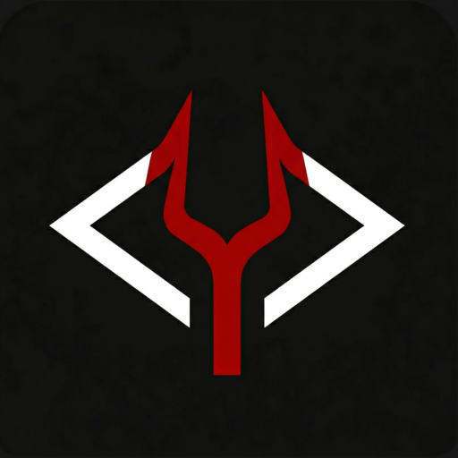

<div align="center">
  

  # Provocateur

  **9 AI agents that challenge every assumption in your code and content.**<br>
  Before code review. Before merge. Before production. Before publish.

  [](LICENSE)
  [](https://claude.ai/code)
  []()
  [](CONTRIBUTING.md)

</div>


## What is Provocateur?

Provocateur is a [Claude Code](https://claude.ai/code) plugin that deploys nine specialized devil's advocate agents. Each agent assumes the code or content is **wrong until proven otherwise** — finding SOLID violations, security holes, N+1 queries, bad HTTP contracts, flaky tests, and performative LinkedIn posts before they reach production or your feed.

Think of it as a colleague who never pulls punches — in code review or content review.

## Agents

| Agent | Attacks | Invoke when... |
|-------|---------|----------------|
| `devils-advocate-code` | SOLID principles, Clean Architecture, DRY | Finishing a class or service |
| `devils-advocate-security` | OWASP Top 10, CVEs, crypto failures, injection | Merging auth or data-handling code |
| `devils-advocate-api-design` | HTTP semantics, REST conventions, response contracts | Adding or changing endpoints |
| `devils-advocate-performance` | N+1 queries, unbounded fetches, missing indexes | Writing queries or collection loops |
| `devils-advocate-unit-tests` | PHPUnit compliance, coverage gaps, mock discipline | After writing unit tests |
| `devils-advocate-feature-tests` | Integration patterns, Foundry, SchemaTool standards | Before closing a story |
| `devils-advocate-static-analysis` | PHPStan level 9, PHP-CS-Fixer, type safety | As a pre-merge quality gate |
| `devils-advocate-linkedin-post-reviewer-personal` | AI smell, theatre, substance, hook, voice | Before publishing a personal LinkedIn post |
| `devils-advocate-linkedin-post-reviewer-brand` | AI smell, PR theatre, substance, brand voice, credibility | Before publishing a company LinkedIn post |

## Installation

### Manual

```bash
git clone https://github.com/JaWitold/provocateur ~/.claude/plugins/provocateur
```

Then register the plugin in your Claude Code settings (`~/.claude/settings.json`):

```json
{
  "plugins": ["~/.claude/plugins/provocateur"]
}
```

Restart Claude Code. All 7 agents are available immediately — no further configuration needed.

## Usage

Once installed, invoke agents by name in any conversation:

```
Run devils-advocate-code on OrderService
Run devils-advocate-security on the login flow
Run devils-advocate-performance on ProductRepository
```

Or ask Claude to pick the right agent automatically:

```
Challenge this code with the appropriate devil's advocate
```

## Why Provocateur?

- **Catches issues early** — find problems before a human reviewer has to point them out
- **Zero configuration** — clone, register, done
- **Opinionated by design** — agents default to skepticism, not politeness
- **PHP-native depth** — the testing and static analysis agents deeply understand PHPUnit, PHPStan level 9, and PHP-CS-Fixer
- **Composable** — run one agent or chain several; each is focused and fast

## Contributing

Want to add a new devil's advocate domain? See [CONTRIBUTING.md](CONTRIBUTING.md).

## Changelog

See [CHANGELOG.md](CHANGELOG.md).

## License

MIT — see [LICENSE](LICENSE).
